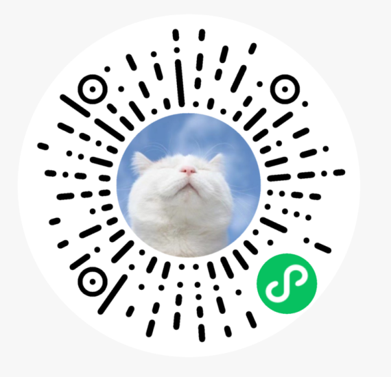

# :pencil:中大猫谱（笃行猫谱）

*——拍照记录校园内猫猫的成长轨迹* :cat::smiley_cat::heart_eyes_cat:

## 主要功能
**猫猫档案**：创建校园猫猫资料档案，猫猫相册，精选瀑布流。

**用户交互**：用户可以上传照片，发表留言，点赞照片或反馈信息。

**丰富功能**：包括拍照识猫，查看科普信息、公告文章等丰富功能。

**管理后台**：部署完成后，资料管理、照片审核等操作均在小程序端完成。

## 体验一下
打开微信，扫码或搜索“笃行猫谱”（原名中大猫谱，23年底更名）。

### 朋友们的小程序

|小程序|高校|二维码|小程序|高校|二维码|
|:----:|:----:|:----:|:----:|:----:|:----:|
|CQGCZY小猫之家|重庆工程职业技术学院||莲峰猫谱|电子科技大学中山学院||
|昆院猫谱|昆明学院KMU||猫猫家谱|暨南大学||
|火大猫谱|火箭军工程大学||CW猫咪图鉴|重庆外语外事学院||
|龙井是公猫|广东药科大学||技大喵喵屋|深圳技术大学||
|招财喵谱|上海财经大学||崴喵猫谱|山东大学（威海）||
|可每猫咪|河海大学||喵汪图鉴|湖南大学||
|青猫图鉴|青岛大学||小理猫谱|广州理工学院||
|一喵九鼎图鉴|河南科技大学||财猫之家|浙江财经大学||

如果，你所在校园（/社团/小区...）的猫猫:smile_cat:也盼望拥有一份属于自己的猫猫档案，请你跟随下一章节的指引，为它们部署、发布一份独特的猫谱小程序。

部署完成后，可以邀请你的朋友帮忙管理猫猫信息。我们为此准备了【猫谱-管理员手册】，信息管理无需接触代码。

部署过程中遇到任何问题，可以：
* 加入猫谱技术交流QQ群：956808218
* 在GitHub页面提issue

## 资料整理
|资料名|类型|链接|
|:----:|:----:|:----:|
|猫谱-部署文档|文档|https://docs.qq.com/doc/DSE1vd0p3RERvWXJS|
|猫谱-管理员手册|文档|https://docs.qq.com/doc/DSEl0aENOSEx5cmtE|

# :scroll:部署

:smirk_cat:*无需从零开始，只要一些耐心。*

EMAS版暂时没有录制部署视频，部署流程请参考：[猫谱EMAS版文档](https://docs.qq.com/doc/DSE1vd0p3RERvWXJS)

注：考虑到Laf平台不再维护，迁移到阿里云的EMAS Serverless平台，比较稳定。费用每个月：EMAS后端5元左右，腾讯云COS存照片约5元左右。代码迁移过程非常感谢[maopu-EMAS项目](https://github.com/Smileye-v/maopu-EMAS)。

# :dancers:开发团队

本项目的开发工作100%用爱发电，特别感谢每一位为此付出的小伙伴。

:computer:代码开发：[Zing22](https://github.com/Zing22)、[Jazon](https://github.com/jxzhn)、[Junius](https://github.com/JunDeer)、[yw](https://github.com/WondrousWisdomcard)、[Lauzeyu](https://github.com/parsifal486)、[Smileye-v](https://github.com/Smileye-v)

:black_nib:UI设计：蓝卷、[Junius](https://github.com/JunDeer)、[yw](https://github.com/WondrousWisdomcard)

:notebook:资料整理：笃行志愿服务队及各校区小伙伴

如果你有新的想法或建议，非常欢迎你在QQ群/issue板块发起讨论，或者提交代码PR。

# :ferris_wheel:开源协议

本项目遵循MPL-2.0开源协议。在此基础上，如果你发布了一份新的猫谱，我们希望你能保留中大猫谱的友情链接。待你的线上版本稳定使用一段时间后，请留言告诉我们将你的友链加到中大猫谱小程序中。
