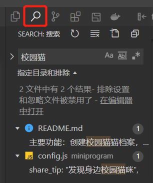

# :pencil:中大猫谱

*——拍照记录校园内猫猫的成长轨迹* :cat::smiley_cat::heart_eyes_cat:

主要功能：创建校园猫猫档案，为猫猫上传照片，以及照片审核，人员管理等。

## 体验一下

打开微信，扫码或搜索“中大猫谱”。

## 朋友们的小程序

||||
|:----:|:----:|:----:|
|华农喵星人|汇景猫党|HNU喵汪图鉴|
|||
|财猫之家|二师猫语|

如果，你所在校园（/社团/小区...）的猫猫:smile_cat:也盼望拥有一份属于自己的猫猫档案，请你跟随下一章节的指引，为它们部署、发布一份独特的猫谱小程序。

部署完成后，可以邀请你的朋友帮忙管理猫猫信息。我们为此准备了【猫谱-管理员手册】，信息管理无需接触代码。链接：https://docs.qq.com/doc/DSEl0aENOSEx5cmtE

部署过程中遇到任何问题，可以选择：
* 加入猫谱技术交流微信群，点击查看群二维码：https://docs.qq.com/doc/DSFNQd1VVSG1CeG5T
* 加入猫谱技术交流QQ群：956808218
* 查看【猫谱-部署常见问题】文档（必看！），链接：https://docs.qq.com/doc/DSGFSU25jalpEZ2FO
* 发邮件至：dxzyfwd@163.com
* 在部署演示视频下留言，链接：https://www.bilibili.com/video/BV1zA411W7Rn/
* 在GitHub页面提issue

## 资料整理
|资料名|类型|链接|
|:----:|:----:|:----:|
|部署视频|视频|https://www.bilibili.com/video/BV1Sb4y1W7gS|
|猫谱-部署常见问题|文档|https://docs.qq.com/doc/DSGFSU25jalpEZ2FO|
|猫谱-管理员手册|文档|https://docs.qq.com/doc/DSEl0aENOSEx5cmtE|
|猫谱-升级代码|文档|https://docs.qq.com/doc/DSExBY2RsUHlOYlpj|
|imProcess云函数部署|视频|https://www.bilibili.com/video/BV1zA411W7Rn|
|imProcess云函数环境|压缩包|https://wwz.lanzout.com/iefHj01u0ddi|

# :scroll:部署

:smirk_cat:*无需从零开始，只要一些耐心。*

## 前期准备

- [ ] 在[微信公众平台](https://mp.weixin.qq.com/)（ https://mp.weixin.qq.com/ ）注册小程序账号
- [ ] 挑选并设置好小程序名称及LOGO
- [ ] 下载并安装[微信开发者工具](https://developers.weixin.qq.com/miniprogram/dev/devtools/download.html)稳定版（ https://developers.weixin.qq.com/miniprogram/dev/devtools/download.html ）
- [ ] 进入[Releases页面](https://github.com/Zing22/zhongdamaopu/releases)，下载最新版本的的Source code(zip)，解压
- [ ] 替换`initDatabase/系统图片`中的图片（稍后再换也行）

## 代码部署

我们在2022年3月录制了一份代码部署视频（ https://www.bilibili.com/video/BV1Sb4y1W7gS ），希望这段视频能帮助你完成部署阶段最繁杂的部分。

以下是一些你需要完成的关键操作，**如无特别说明**（:warning:符号），则与视频演示一致。

### 导入项目

- [ ] 在微信开发者工具中导入项目，并修改APPID

期望：开发工具中有三只跳动小猫的loading图像，则说明导入成功。

### 进入部署模式

- [ ] 开发者工具中，点击上方中间的“普通编译”（在编译键旁边），在下拉框中选择“部署指引”

期望：页面切换到**部署检测&指引**页，有多项自动检测的结果（应该都是未通过）。后续这个页面会帮助你检查部署情况，并自动化完成一些部署操作。

### 开通云开发、部署云函数

- [ ] 在开发工具右上角开通**云开发**服务，创建云环境，相当于后端服务器
- [ ] 在云环境的“配额方案”中，[切换成按量付费](https://developers.weixin.qq.com/miniprogram/dev/wxcloud/billing/adjust-payment.html)，下一步才能部署超过15个云函数
- [ ] 点击部署`cloudfunctions`文件夹中的所有云函数，直至所有文件夹变成绿色图标

期望：点开云开发可以看到面板数据，则说明开通成功。重新编译后，部署检查的第1、2项状态为通过。

### 特殊依赖安装
对于 `imProcess` 云函数，无法云端自动安装图像处理依赖库，需要手动上传。这一步比较繁琐，可以参考[演示视频](https://www.bilibili.com/video/BV1zA411W7Rn)（特别感谢happi0同学的实践经验）。

- [ ] 下载云函数运行环境压缩包`imProcess_node_modules_v2.zip`，链接：https://wwz.lanzout.com/iefHj01u0ddi
- [ ] 完成上一步的部署后，登录[腾讯云网页端-云开发CloudBase](https://console.cloud.tencent.com/tcb)，选择云开发环境，左侧云函数，记下`imProcess`函数的运行环境，例如`Nodejs12.16`或`Nodejs10.15`
- [ ] 点击上方“层管理”，新建一个层，名称和描述随便填。把刚才下载的[imProcess_node_modules_v2.zip](https://wwz.lanzout.com/iefHj01u0ddi)文件上传上去，环境选刚才记下的`Nodejs`版本
- [ ] 再点击左侧云函数，选择`imProcess`，层管理中点击“绑定”，选择刚才创建的层
- [ ] 另外，为了避免一次处理过多图片导致程序执行超时，需要在云开发面板中依次点击“云函数-imProcess-版本与配置-配置-高级配置”，将内存设置为384，超时时间调整为60

期望：在腾讯云网页端中，云函数`imProcess`的层管理列表中，出现刚绑定上的依赖层。

### 创建数据集合（无需手动操作）

这一步已经实现了自动化，保证上一步操作完成后，部署指引页面会帮你完成数据库创建、数据初始化、权限配置操作。如果部署检查的第3项“创建数据库”的状态为通过，则不需要操作下面4步。

- [ ] 创建9个数据集合：`cat, feedback, photo, photo_rank, reward, science, setting, user, comment`
- [ ] 设置上述9个数据集合权限为第一项：“所有用户可读、仅创建者可读写”
- [ ] 导入`initDatabase/database-setting.json`文件到`setting`数据集合
- [ ] 导入`initDatabase/database-science.json`文件到`science`数据集合

期望：关于页出现中大猫谱的友情链接、科普的二级页面出现文字信息，则说明创建成功。

### 替换系统图片

- [ ] 在云存储中创建`系统`文件夹，上传`initDatabase/系统图片`中的所有图片
- [ ] 替换`miniprogram/config.js`中的图片链接为刚刚上传的文件的**File ID**

期望：部署检查的第4项“系统云储存图片”状态为通过。并且，科普页、打赏页的赞赏码、反馈页新猫问卷的图片可以显示，则说明替换成功。当部署检查的所有项都通过后，请点击编译按钮旁边的“部署指引”，切换回“普通编译”。

### 赋予管理员权限（无需手动操作）

这一步已经实现了自动化，保证部署检查的第3项通过后，跳转到关于页，应该能看到管理后台的各个按钮，则无需操作下面两步。

- [ ] 在小程序端，“拍照月榜”中点击授权
- [ ] 在数据库`user`集合中，为自己添加字段`manager`类型`number`，值为`99`

期望：关于页出现管理后台的各个按钮，则说明赋予成功。

*PS：此后，人员权限管理可在小程序端（由拥有99权限的用户）操作，给其他授权过的用户添加管理员权限。*

### 修改校区信息

在本项目中，猫猫所在的地理位置的层级为：校区->小区域，例如“新校区->图书馆”。

- [ ] 在数据库`setting`集合中，修改`filter`项中的`campus`字段为你的**校区名**列表
- [ ] 在小程序端，“区域、花色管理”中添加各个校区的小区域的名称

期望：点击首页搜索栏旁边的过滤器按钮，校区及区域信息正确显示，则说明修改成功。

*PS：在有猫猫档案的情况下，不建议进行删除校区操作。如确实需要执行该操作，记得更新该校区下的所有猫猫的地理位置信息，否则将无法通过校区检索到这些猫猫。*

### 添加第一只猫

- [ ] 在小程序端，“添加新猫”中创建第一份猫猫档案
- [ ] 在开发工具中点击预览，使用手机完成第一张照片上传的操作
- [ ] 在小程序端，体验“照片审核”、“照片处理”的管理操作

期望：首页刷新后，出现新猫猫及其照片，则说明添加成功。

*PS：照片审核时，精选照片将出现在猫猫详情的顶栏，且会随机成为首页的猫猫大图。单纯的通过只会加入猫猫相册。删除操作将无法恢复。*

*PPS：照片处理是利用小程序端canvas绘图能力给照片加水印、制作缩略图，有利于节省流量。现已用imProcess云函数实现自动化操作。*

*PPPS：非常不建议进行猫猫删除操作，这可能会导致猫猫ID错乱等一系列后果。在有需要删除一只猫的时候，可以考虑将该猫修改名称，用作下一只猫猫的档案。*

### 替换通知模板（在首次发布后才能操作）

- [ ] 在[微信公众平台](https://mp.weixin.qq.com/)开通订阅消息服务
- [ ] 参考`initDatabase/消息模板.png`申请多个消息模板
- [ ] 替换`miniprogram/config.js`中的模板ID及字段名，例如`thing5`、`time2`

期望：照片审核、回复反馈等操作后，已订阅消息的用户收到相应微信通知，则说明替换成功。

*PS：提醒审核通知的订阅方式，是点击照片审核页面的“刷新状态”*

## 个性化修改

:orange_book::green_book::blue_book: *替换文字、主题色、图标，即可获得一份全新的、独一无二的猫猫小程序。*

### 文本方面

页面上大多数文本都整理在`miniprogram/config.js`文件中，修改即可全局生效。在`miniprogram/app.json`中，也有一些小程序配置文本。

除此之外，也可以使用开发者工具的全局文本搜索&替换功能，找到其他你想替换的文字。

### 样式方面

在代码文件`miniprogram/app.wxss`中定义了一些颜色变量，修改它们将会影响全局CSS颜色。其中主题色的HEX值为`#ffd101`，在`miniprogram/app.json`中也有使用，需要一并修改。

### 静态图标方面

限于技术水平，一些静态资源中的主题色无法使用代码修改。需要在`miniprogram/images`中进行图片替换，只需注意不要弄错文件名。

已经上传到云开发存储中的图片，可以用同样名称的文件进行覆盖。此操作会实时线上生效，不需要重新审核发布。

## 提交审核前的最终准备

为顺利通过平台审核，请最终确定以下几个事项：

- [ ] 确定整个项目都已修改完毕，不存在任何页面报错
- [ ] 已创建数只猫猫档案，且有一些照片

此后就是上传、提交审核、祈祷、发布正式版等一系列操作。正式版上线后，请检查每只猫猫的菊花码是否能顺利生成。

### 审核须知
1. 当修改了`miniprogram`文件夹下的任何内容，都需要发起审核，重新发布才能对线上版本生效
2. 而如果修改的是`cloudfunctions`中的内容，则需要重新部署该云函数，不需要审核发布
3. 如果修改的是“云开发”中的数据库或存储，则会实时对所有版本生效，不需要审核发布

# :game_die:设置项说明

在数据库的`setting`表中，控制着一部分页面表现，可以随时修改并在小程序端展现。

## pages

主要设置各个页面的元素展示。

|设置项|子设置项|描述|
|:----|:----|:----|
|checkFeedback|step|反馈处理页每次加载数量|
|detailCat|albumStep|猫猫相册每次加载数量|
|    |cantUpload|关闭上传功能的版本号|
|    |galleryCompressed|相册大图是否使用压缩图|
|    |galleryPreload|相册大图预加载的数量|
|    |manageUpload|上传功能强制给管理员开启|
|    |photoStep|猫猫精选图每次加载的数量|
|genealogy|adStep|广告出现的间隔|
|    |catsStep|首页每次加载猫猫的数量|
|    |main_lower_threshold|首页触底加载的像素值|
|    |photoPopWeight|每张猫猫照片增加的人气值|

## filter

主要用于猫猫信息修改，及首页过滤器。

|设置项|描述|
|:----|:----|
|area|区域（请使用小程序端修改）|
|campuses|校区（谨慎修改）|
|colour|花色（请使用小程序端修改）|

## friendLink

用于设置友情链接，请参考样例进行添加。

|设置项|描述|
|:----|:----|
|appid|小程序的APPID|
|logo|小程序的图标，可以使用云存储FileID|
|name|小程序的名称|

## subscribeMsg

用于管理员订阅的数量设置。

|设置项|子设置项|描述|
|:----|:----|:----|
|chkFeedback|receiverNum|最多推送给几位管理员（暂未生效）|
|verifyPhoto|receiverNum|最多推送给几位管理员|
|    |triggerNum|触发推送的待审核数量|

# :notebook_with_decorative_cover:管理员手册

管理员使用时，请参考此共享文档：【猫谱-管理员手册】https://docs.qq.com/doc/DSEl0aENOSEx5cmtE ，可以发给其他管理员查阅。

# :dancers:开发团队

本项目的开发工作100%用爱发电:sparkles:，特别感谢每一位为此付出的小伙伴。

:computer:代码开发：渔政、XD、zJ

:black_nib:UI设计：蓝卷、zJ

:notebook:资料整理：笃行志愿服务队及各校区小伙伴

如果你有新的想法或建议，非常欢迎你在issue板块发起讨论或者提交代码PR。

# :ferris_wheel:开源协议

本项目遵循MPL-2.0开源协议。在此基础上，如果你发布了一份新的猫谱，我们希望你能保留中大猫谱的友情链接。待你的线上版本稳定使用一段时间后，请留言告诉我们将你的友链加到中大猫谱小程序中。

